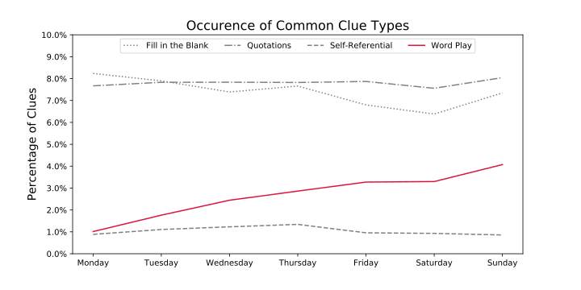

# NLP Crossword

## Objective:

Predict puzzle difficulty based on semantic features and topic modeling of puzzle clues.

## Featured Techniques:

- MongoDB
- Feature Engineering 
- Logistic Regression
- Supervised & Unsupervised Learning
- Natural Language Proessing
  - Count Vectorization
  - Stop Words
  - Tokentization 
- Dimensionality Reduction
  - Latent Semantic Analysis (LSA)
  - Non-negative Matix Factorization (NMF)

## Methodology:

### Corpus:

	* Over 14 thousand puzzles 
	* Nearly 1.3 million clues and answers
	* Puzzles dating back to 1977
	* Spans two editors and over 1700 unique authors 

### Processing:

### Exploratory Data Analysis (EDA):

	* Day of week of first incidence of answer
 * Prevelance of clues by type by day of week:
   	* Fill in the blank
   	* Quotations and literary references 
   	* Self-referential 
   	* Puns and word play

### Topic Modeling:

### Classification:

## Analysis:

## Results:

## Future Work:

* Letter frequency
* Answer length
* Named entity recognition
* Analysis by author
* Analysis by editor
* Changes over time
* Refined topic analysis
* Consider using individual clues as docs
* Clustering
* Try other classifiers and ensembling (Naive Bayes?)
* LDA?

## Data Source:

https://github.com/doshea/nyt_crosswords